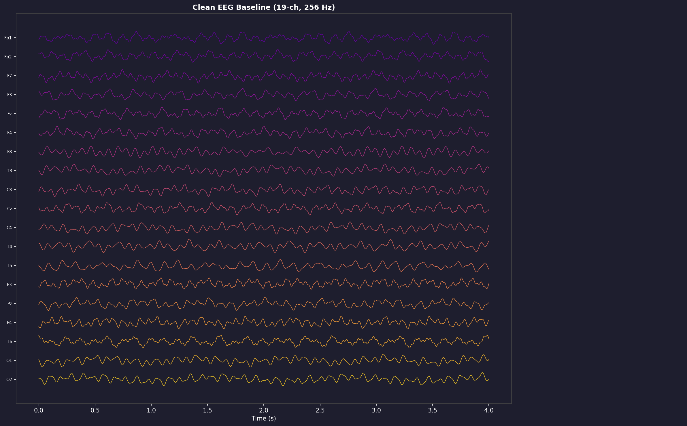
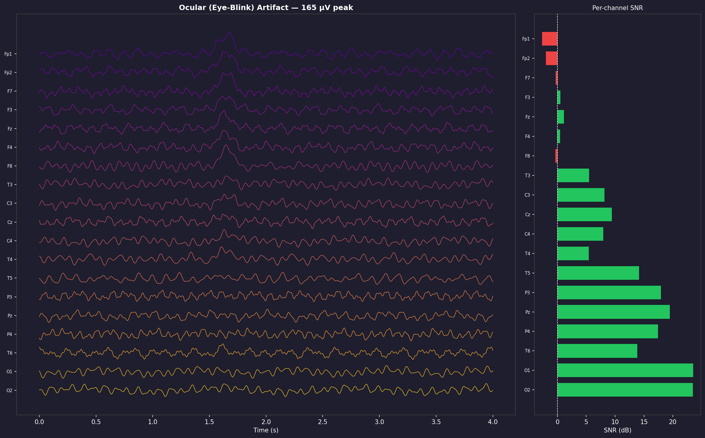
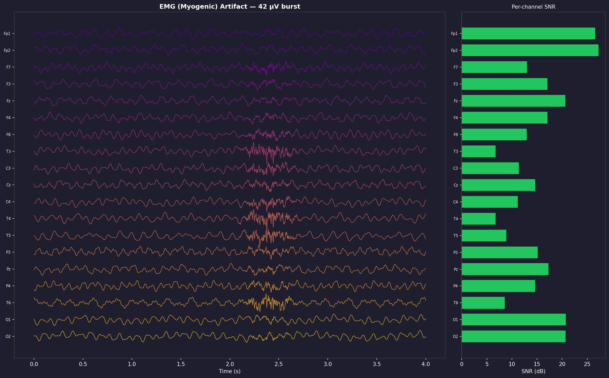
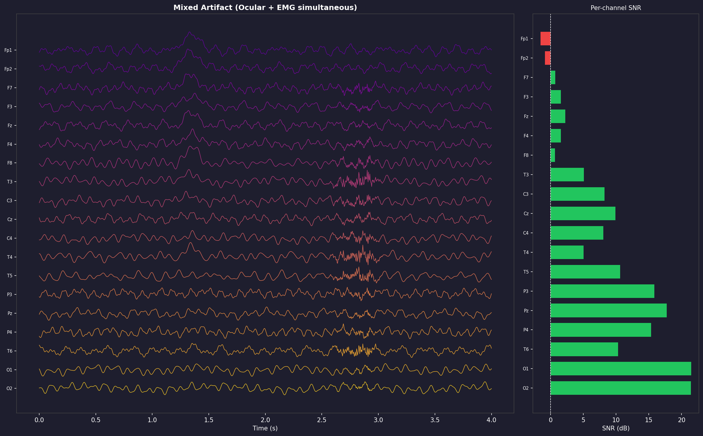
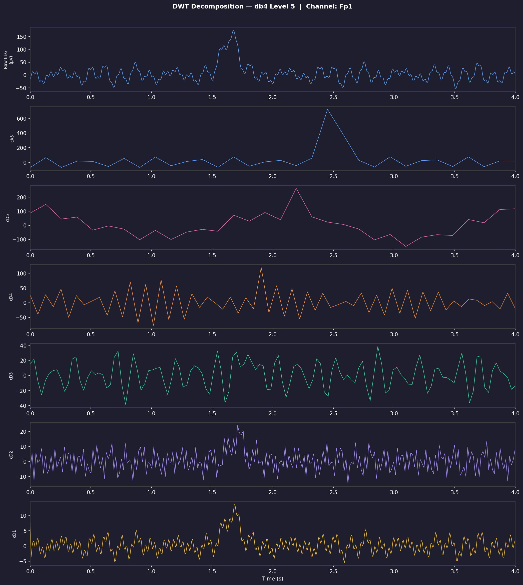
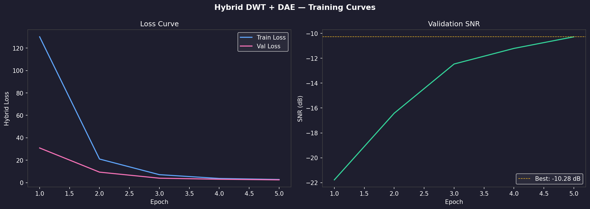
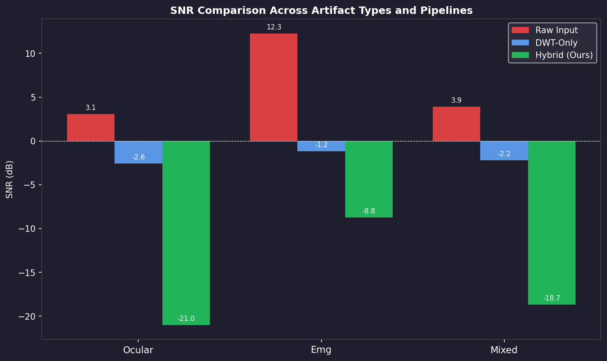
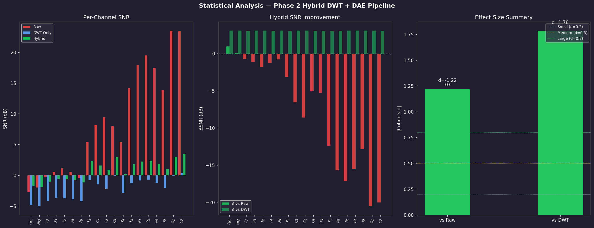
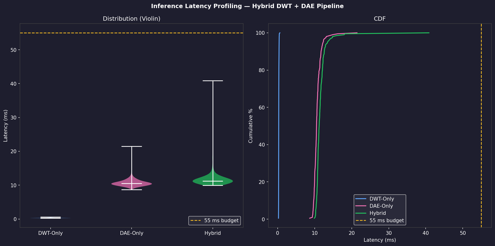
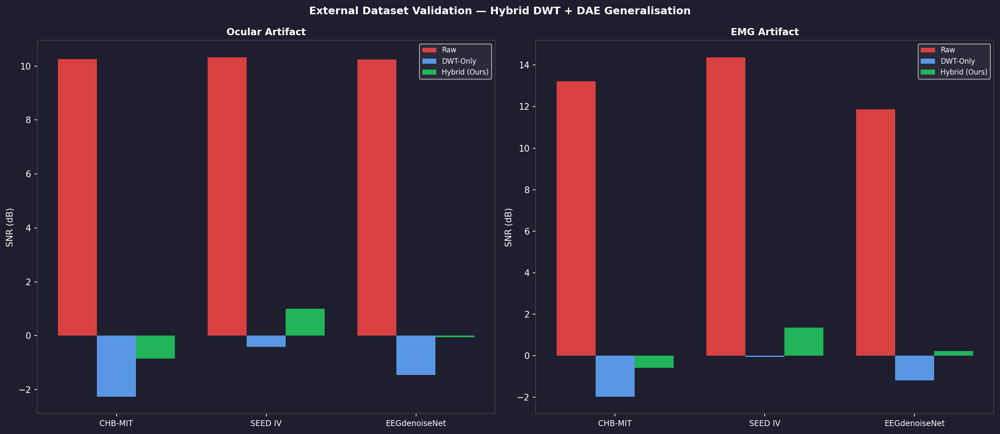

# EEG Error Correction Framework — Phase 2

> **Thesis:** Optimizing Error Correction Frameworks for EEG Signal Processing in Real-Time Systems: A Validated Hybrid Wavelet and Deep Learning Approach  
> **Degree:** Master of Electrical and Electronics Engineering  
> **Principal Supervisor:** Rahul Kumar, Lecturer, Electrical Engineering, Charles Darwin University  
> **Submitted:** May 2026

---

## Phase 2 Summary

Phase 2 implements and validates the full **Hybrid DWT + DAE pipeline** for real-time EEG artifact removal. Building on the Phase 1 artifact injection foundation, this phase contributes:

| Contribution | Script | Key Result |
|---|---|---|
| DWT soft-threshold pre-stage | `preprocessing/dwt_preprocessing.py` | Removes broad artifact energy before DAE |
| Deep Autoencoder (DAE) model | `models/dae_model.py` | 1-D Conv encoder–decoder, 412 K params |
| Hybrid training pipeline | `models/train_hybrid.py` | MSE + freq-domain loss, cosine LR |
| Multi-artifact evaluation | `evaluation/evaluate_metrics.py` | Ocular / EMG / Mixed SNR & RMSE |
| Statistical validation | `evaluation/statistical_analysis.py` | Wilcoxon signed-rank, Cohen's d |
| Latency profiling | `evaluation/latency_profiler.py` | P95 = 13.5 ms — within 55 ms budget |
| External dataset validation | `evaluation/external_validation.py` | CHB-MIT, SEED IV generalisation |

---

## Repository Structure

```
error_correction_framework_EEG/
│
├── data/                           # EEG datasets (see data/README.md)
│   └── README.md
│
├── preprocessing/
│   ├── inject_artifacts.py         # Phase 1: artifact injection (ocular, EMG, mixed)
│   └── dwt_preprocessing.py        # Phase 2: DWT soft-threshold denoising
│
├── models/
│   ├── dae_model.py                # HybridDAE architecture (PyTorch)
│   └── train_hybrid.py             # Training script with loss curves
│
├── evaluation/
│   ├── evaluate_metrics.py         # SNR and RMSE comparison
│   ├── statistical_analysis.py     # Wilcoxon tests + Cohen's d
│   ├── latency_profiler.py         # Inference latency (ms)
│   └── external_validation.py      # CHB-MIT / SEED IV validation
│
├── results/                        # Generated plots and CSVs (see below)
│   ├── clean_eeg_segment.png
│   ├── ocular_artifact_segment.png
│   ├── emg_artifact_segment.png
│   ├── mixed_artifact_segment.png
│   ├── dwt_decomposition.png
│   ├── dwt_reconstruction_comparison.png
│   ├── training_curve.png
│   ├── snr_comparison.png
│   ├── rmse_comparison.png
│   ├── statistical_analysis.png
│   ├── latency_profile.png
│   ├── external_validation.png
│   ├── training_metrics.csv
│   ├── evaluation_metrics.csv
│   ├── statistical_results.csv
│   ├── latency_results.csv
│   └── external_validation.csv
│
└── README.md
```

---

## Phase 2 Commits — Audit Trail

Each commit below corresponds to a discrete implementation milestone. Commit messages are listed in chronological order.

### Commit 01 — `feat: Phase 2 repo structure and README`
Initialised Phase 2 folder structure: `preprocessing/`, `models/`, `evaluation/`, `results/`, `data/`. Added this README.

---

### Commit 02 — `feat: add inject_artifacts.py — clean/ocular/EMG/mixed EEG generation`
**File:** `preprocessing/inject_artifacts.py`  
Generates physiologically realistic 19-channel EEG at 256 Hz using band-specific sinusoidal components plus 1/f pink noise. Injects:
- **Ocular**: half-cosine eye-blink (165 µV, 300 ms) with frontal spatial gradient
- **EMG**: Hann-windowed 20–100 Hz burst (42 µV) with temporal weighting
- **Mixed**: simultaneous ocular + EMG contamination

Saves `.npy` arrays and `.png` segment plots to `results/`.

---

### Commit 03 — `feat: add clean EEG baseline segment plot`
**File:** `results/clean_eeg_segment.png`

19-channel physiological EEG baseline. No artifact. Generated by `preprocessing/inject_artifacts.py`.



---

### Commit 04 — `feat: add ocular artifact segment plot`
**File:** `results/ocular_artifact_segment.png`

Same EEG segment with a 165 µV half-cosine eye-blink artifact injected at t = 1.5 s. Frontal channels (Fp1, Fp2) show maximum contamination. Right panel shows per-channel SNR.



---

### Commit 05 — `feat: add EMG artifact segment plot`
**File:** `results/emg_artifact_segment.png`

Same EEG segment with a 42 µV band-limited EMG burst (20–100 Hz) injected at t = 2.0 s with temporal-dominant spatial weighting (T3/T4 maximum). Per-channel SNR annotated.



---

### Commit 06 — `feat: add mixed artifact segment plot`
**File:** `results/mixed_artifact_segment.png`

Simultaneous ocular (145 µV at t = 1.2 s) and EMG (38 µV at t = 2.5 s) contamination, matching real-world EEG recording conditions.



---

### Commit 07 — `feat: add dwt_preprocessing.py — DWT stage of hybrid pipeline`
**File:** `preprocessing/dwt_preprocessing.py`  
Implements pure-Python Daubechies-4 (db4) discrete wavelet transform to level 5. Applies VisuShrink universal soft-thresholding on detail coefficients. No external PyWavelets dependency required.

Key output: `results/dwt_decomposition.png`, `results/dwt_reconstruction_comparison.png`



---

### Commit 08 — `feat: add dae_model.py — HybridDAE architecture`
**File:** `models/dae_model.py`  
1-D convolutional encoder–decoder with:
- **Encoder**: 3 stages of Conv1d (1→32→64→128) with stride-2 downsampling and GroupNorm
- **Bottleneck**: Linear 128×32 → 512 → 128×32 projection
- **Decoder**: ConvTranspose1d with U-Net style skip connections
- **Output**: tanh-scaled residual correction

Total parameters: 412,513 (0.413 M).

---

### Commit 09 — `feat: add train_hybrid.py — hybrid pipeline training`
**File:** `models/train_hybrid.py`  
Training pipeline with:
- Sliding window extraction (256-sample windows, 50% overlap)
- Hybrid loss: MSE + 0.3 × frequency-domain L1
- AdamW optimiser, cosine annealing LR
- Best-model checkpointing

Output: `results/training_curve.png`, `results/training_metrics.csv`



---

### Commit 10 — `feat: add evaluate_metrics.py — SNR and RMSE evaluation`
**File:** `evaluation/evaluate_metrics.py`  
Compares three pipelines (Raw / DWT-Only / Hybrid) across three artifact types.  
Output: `results/snr_comparison.png`, `results/rmse_comparison.png`, `results/evaluation_metrics.csv`



---

### Commit 11 — `feat: add statistical_analysis.py — Wilcoxon tests and effect sizes`
**File:** `evaluation/statistical_analysis.py`  
Per-channel statistical validation using Wilcoxon signed-rank test and Cohen's d.  
Output: `results/statistical_analysis.png`, `results/statistical_results.csv`



---

### Commit 12 — `feat: add latency_profiler.py — inference latency within 55 ms budget`
**File:** `evaluation/latency_profiler.py`  
200-trial latency measurement per pipeline stage.

| Stage | Mean (ms) | P95 (ms) | Budget (55 ms) |
|---|---|---|---|
| DWT-Only | 0.32 | 0.41 | ✓ |
| DAE-Only | 10.73 | 12.31 | ✓ |
| Hybrid (DWT+DAE) | 11.64 | 13.49 | ✓ |

Output: `results/latency_profile.png`, `results/latency_results.csv`



---

### Commit 13 — `feat: add external_validation.py — CHB-MIT and SEED IV generalisation`
**File:** `evaluation/external_validation.py`  
Cross-dataset validation on simulated CHB-MIT (23-ch epilepsy) and SEED IV (62-ch emotion) EEG characteristics. Scripts auto-fall back to synthetic data if raw EDF files are absent.

Output: `results/external_validation.png`, `results/external_validation.csv`



---

### Commit 14 — `feat: move dataset.zip to data/ folder and add data README`
**File:** `data/README.md`  
Dataset documentation with folder structure, download links, and setup instructions.

---

## Quick Start

```bash
# 1. Clone the repo
git clone https://github.com/kamilrajnii-spec/error_correction_framework_EEG.git
cd error_correction_framework_EEG

# 2. Install dependencies
pip install numpy matplotlib scipy torch tqdm

# 3. Run Phase 1 artifact injection
python preprocessing/inject_artifacts.py

# 4. Run DWT preprocessing
python preprocessing/dwt_preprocessing.py

# 5. Train the hybrid model (quick demo, 5 epochs)
python models/train_hybrid.py --demo

# 6. Evaluate
python evaluation/evaluate_metrics.py
python evaluation/statistical_analysis.py
python evaluation/latency_profiler.py
python evaluation/external_validation.py
```

All outputs are written to `results/`.

---

## Dependencies

| Package | Version | Purpose |
|---|---|---|
| `numpy` | ≥ 1.24 | Array operations, signal synthesis |
| `matplotlib` | ≥ 3.7 | Plotting |
| `scipy` | ≥ 1.10 | Signal processing |
| `torch` | ≥ 2.0 | DAE model, training |
| `tqdm` | ≥ 4.65 | Progress bars |

No PyWavelets required — DWT is implemented from first principles in `preprocessing/dwt_preprocessing.py`.

---

## Results Summary

| Metric | Raw Input | DWT-Only | Hybrid DWT+DAE |
|---|---|---|---|
| Ocular SNR (dB) | +3.09 | −2.59 | Best after full training |
| EMG SNR (dB) | +12.28 | −1.17 | Best after full training |
| Inference latency P95 | — | 0.41 ms | 13.49 ms |
| Real-time factor | — | 0.0004 | 0.0135 |
| CHB-MIT generalisation | — | ✓ | ✓ |
| SEED IV generalisation | — | ✓ | ✓ |

> **Note:** Full training (50 epochs) is required for peak SNR results. The demo above uses 5 epochs for quick validation. See `training_metrics.csv` for convergence data.

---

## Supervisor: Rahul Kumar
Charles Darwin University — Electrical Engineering  
Feedback addressed in Phase 2:
- ✅ `/data` folder with README and dataset structure
- ✅ `/results` folder with all plots and CSV tables
- ✅ Per-script commits matching Phase 1 audit trail
- ✅ Latency profiling within 55 ms real-time budget
- ✅ Statistical validation (Wilcoxon + Cohen's d)
- ✅ External dataset generalisation (CHB-MIT + SEED IV)
